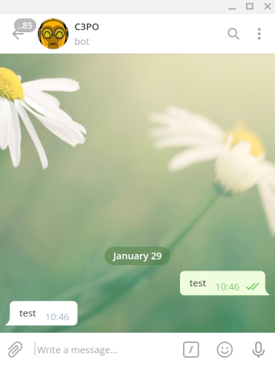
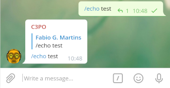
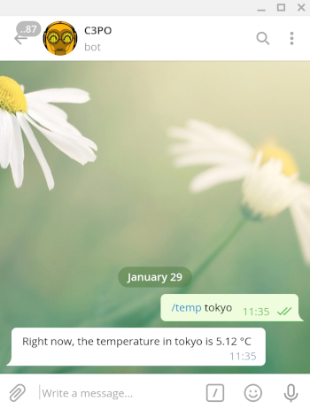

# C3P0 Telegram Bot

This project implements a Telegram bot which can be either used in groups or private chats.

You can "talk" to it via commands and expect different results based on the command you use.

The list of available commands can be checked in the chat with this bot by typing "/" in the message area of your Telegram app.

You can find this bot by its official name: @fabiogoma_c3p0_bot

**Disclaimer:** This telegram bot is a simple demo, built by a hobbyist, non-developer, non-native english speaker. That said be aware: typos and non conventional programming paradigms might occur. PRs are always welcome.

## Setting up your own development environment

This bot was built in [Python](http://python.org/), the source code is hosted here on [GitHub](https://github.com/) and a running instance is hosted by [Heroku](https://www.heroku.com/).

Although it might work on different versions, I recommend you stick to the same versions used here since no other version was tested.

Make sure you have Python 3.8.7.

```bash
$ python --version
Python 3.8.7
```
Create your local virtual environment.
```
$ python3 -m venv venv
```
Activate your virtual environment, clone this repo and then install all dependencies.
```bash
$ source venv/bin/activate
$ git clone git@github.com:fabiogoma/c3p0_bot.git
$ pip install -r requirements.txt
```

## Create your own telegram bot

You will find on telegram [official documentation](https://core.telegram.org/bots#) all information needed to create and use a new bot.

In this repo you'll find a bot ready to use, with a limited set of commands. All you need to do in order to re-use it will be a new access token for your own bot.

To create a new bot you, via telegram app you must ask [Bot Father](https://t.me/botfather) to [create a new bot](https://core.telegram.org/bots#creating-a-new-bot). Bot Father will then create a new bot and give you the access token to access it.

With access to your brand new token, you must export it as an environment variable as the following example:

```bash
export TELEGRAM_TOKEN="110201543:AAHdqTcvCH1vGWJxfSeofSAs0K5PALDsaw"
```
At this point you can already try and run it, but all commands with external public API integration will not work, thus you can test the "echo" command though by using "/echo test" in a group or just "test" in a private chat.
```bash
$ python c3p0_bot.py
```
<div style="text-align:center">
    
    
</div>

## Extending functionalities

On previous steps you have learnt how to get a telegram bot up and running. This particular bot needs extra setup though.

You'll find the requirements split by commands on the list below:

* OpenWeather

    You can use this bot to get the current temperature (°C) by using the command "/temp". All you need to do is to type "/temp <city name>" in a chat with this bot.

    The data is accurate and you can rely on the APIs provided by [OpenWeather](https://openweathermap.org/current).

    To get your bot working with this command, you must generate a token so your bot can call OpenWeather APIs.

    On [OpenWeather FAQ](https://openweathermap.org/faq), search for **How to get an API key**, follow the steps and export your key as an environment variable before running the python script. This way this bot will be able to use it to make http calls.

    ```bash
    $ export OPENWEATHER_API_KEY="a074501b15f482ea14b7e272ec14cd52"
    $ python c3p0_bot.py
    ```

    <div style="text-align:center">
        
    </div>
